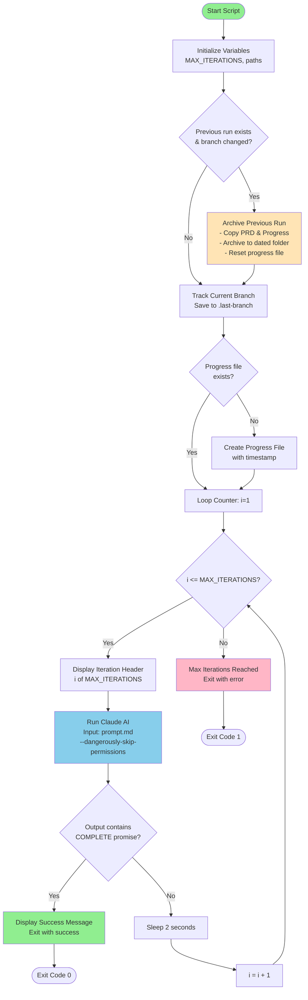

# Ralph Wiggum - AI Agent Loop Script

## Overview

Ralph is a long-running AI agent loop that automates task execution using Claude AI. It repeatedly invokes Claude with a predefined prompt, monitors progress, and archives results when switching between different branches/tasks.

## Architecture Diagram



## Key Components

### 1. **Configuration Variables**
- `MAX_ITERATIONS`: Maximum number of iterations (default: 10, or from CLI arg)
- `PRD_FILE`: Product Requirements Document (prd.json)
- `PROGRESS_FILE`: Running log of progress (progress.txt)
- `ARCHIVE_DIR`: Storage for previous runs
- `LAST_BRANCH_FILE`: Tracks the last branch name

### 2. **Archive System**

When the branch name in `prd.json` changes from the previous run:
1. Creates an archive folder: `archive/YYYY-MM-DD-{branch-name}/`
2. Copies `prd.json` and `progress.txt` to the archive
3. Resets `progress.txt` for the new run

### 3. **Main Loop**

```
For each iteration (1 to MAX_ITERATIONS):
  1. Display iteration header
  2. Execute: cat prompt.md | claude --dangerously-skip-permissions
  3. Check output for completion signal: <promise>COMPLETE</promise>
  4. If complete → exit with success (code 0)
  5. If not complete → sleep 2 seconds and continue
```

### 4. **Completion Detection**

The script looks for a specific XML-like tag in Claude's output:
```xml
<promise>COMPLETE</promise>
```

When found, the script terminates successfully.

### 5. **Exit Conditions**

| Condition | Exit Code | Message |
|-----------|-----------|---------|
| Tasks completed (COMPLETE tag found) | 0 | "Ralph completed all tasks!" |
| Max iterations reached | 1 | "Ralph reached max iterations without completing" |

## Usage

```bash
# Run with default 10 iterations
./ralph.sh

# Run with custom iterations
./ralph.sh 20
```

## File Dependencies

```
ralph/
├── ralph.sh          # This script
├── prompt.md         # Input prompt for Claude
├── prd.json          # Product Requirements Document (contains branchName)
├── progress.txt      # Running progress log
├── .last-branch      # Tracks last branch name
└── archive/          # Archived runs
    └── YYYY-MM-DD-{branch}/
        ├── prd.json
        └── progress.txt
```

## Workflow Example

```
Iteration 1: Claude analyzes prompt → performs tasks → returns output
Iteration 2: Claude continues from where it left off
Iteration 3: Claude finishes → outputs <promise>COMPLETE</promise>
Script: Detects completion tag → exits successfully
```

## Error Handling

- Uses `set -e` to exit on errors
- `|| true` on Claude execution prevents script termination if Claude fails
- Checks for file existence before operations
- Validates JSON parsing with fallback to empty string

## Key Features

✅ **Automatic archiving** when switching branches/tasks  
✅ **Progress tracking** with timestamped logs  
✅ **Iteration limiting** to prevent infinite loops  
✅ **Graceful completion** detection  
✅ **Error resilience** with fallback handling
